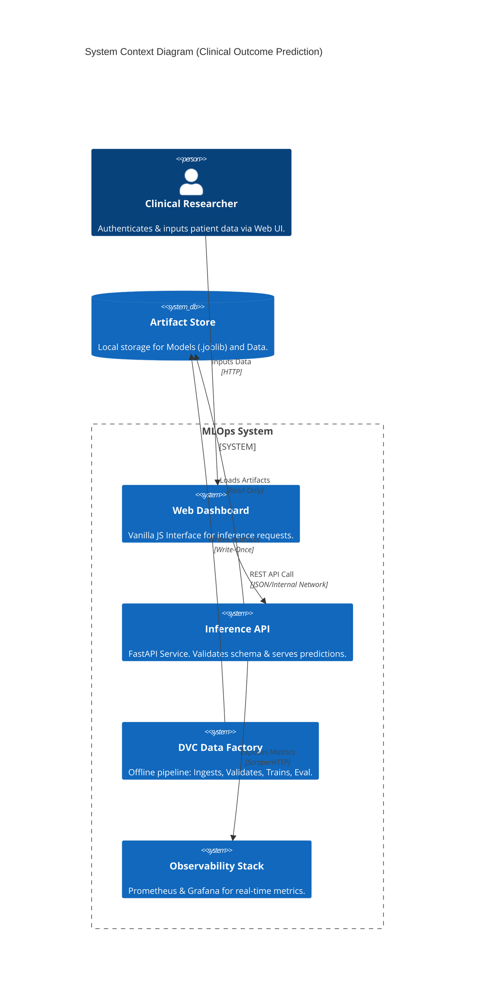
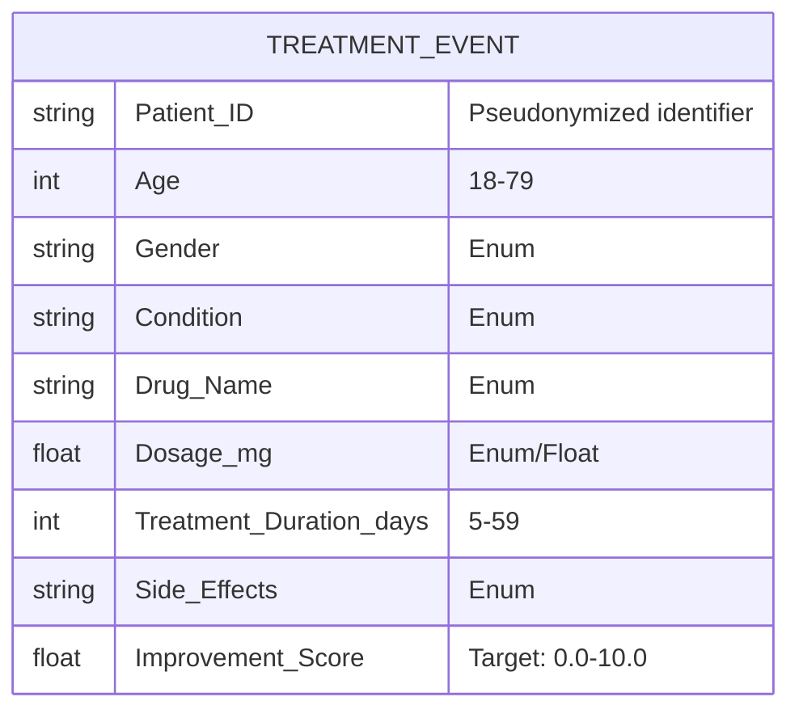
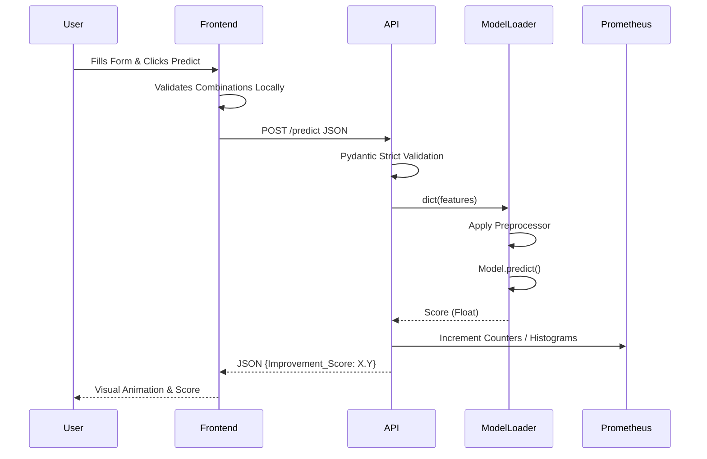

# 🏥 MLOps System: Clinical Treatment Outcome Prediction

<div align="center">


**A production-hardened, zero-trust MLOps system for predicting clinical treatment outcomes.**

</div>

---

## 1. Executive Overview

### Purpose
The Clinical Treatment Outcome Prediction module is a production-grade Machine Learning Operations (MLOps) system. It predicts the efficacy of pharmaceutical treatments based on patient demographics, medical history, and prescribed regimens.

### Business & Technical Problems Solved
- **Business**: Clinicians and clinical researchers need data-backed heuristics to estimate how well a patient will respond to a specific drug dosage and treatment duration.
- **Technical**: ML models degrade over time and fail silently in production. This system solves this by introducing strict data contracts, reproducible Data Version Control (DVC) pipelines, containerized serving, and real-time observability.

### Role Within the System
This repository constitutes the entire end-to-end slice: from raw data ingestion and pipeline validation to model training, containerized API inference, and frontend visualization.

### High-Level Instructions
To spin up the entire isolated prediction environment locally:
```bash
# Clone the repository
git clone https://github.com/iammohith/MLOps-System-For-Clinical-Treatment-Outcome-Prediction.git
cd MLOps-System-For-Clinical-Treatment-Outcome-Prediction

# Start the full 4-container system (API, Frontend, Prometheus, Grafana)
docker-compose -f infra/docker/docker-compose.yml up --build -d
```
### 🌐 System Access Points
Once the containers are successfully provisioned, the system exposes the following graphical interfaces:

- **Clinical Dashboard (Frontend)**: [http://localhost:8080](http://localhost:8080) - The primary zero-dependency UI for clinicians to securely input patient telemetry and receive predictions.
- **Inference API (Swagger Docs)**: [http://localhost:8000/docs](http://localhost:8000/docs) - Interactive OpenAPI specifications detailing the Pydantic schemas, validation rules, and REST endpoints for the prediction engine.
- **Grafana Observability**: [http://localhost:3000](http://localhost:3000) - Live performance dashboards, latency histograms, and API traffic metrics (Default Login: `admin` / `changeme`).
- **Prometheus Targets**: [http://localhost:9090](http://localhost:9090) - The raw time-series metric database and scrape configuration UI.

---

## 2. System Context & Architecture

### System Context Diagram



### Architectural Style
- **Microservices Deployment**: The runtime is decomposed into an API backend, a Frontend UI, and Monitoring sidecars.
- **Pipeline-as-Code (DAG)**: Training is managed via a Directed Acyclic Graph (DAG) codified in `dvc.yaml`.
- **Zero-Trust Input Validation**: Deep integration between `params.yaml` (schema truth) and `schemas.py` ensures bad data cannot enter training or inference.

---

## 3. Component-Level Design

### Core Modules

1. **`inference/` (Model Serving)**
   - **Responsibility**: Exposes the trained model via a REST API.
   - **Dependencies**: FastAPI, Pydantic, Scikit-Learn, Prometheus Client.
   - **Internal Abstraction**: Separates `app.py` (routing) from `model_loader.py` (singleton model memory management) and `schemas.py` (validation).

2. **`frontend/` (User Interface)**
   - **Responsibility**: Client-side single-page application (SPA).
   - **Dependencies**: Vanilla JS, CSS.

3. **`pipelines/` & `training/` (Offline DAG)**
   - **Responsibility**: Ingestion, pre-processing, and Random Forest model training.
   - **Dependencies**: Pandas, Scikit-Learn, DVC.

4. **`monitoring/` & `infra/` (Ops)**
   - **Responsibility**: Container definitions and observability configurations.

---

## 4. Data Design

### Schema Structure & Entity Relationships
The core domain entity is the **Patient Treatment Event**.



### Validation Strategy
- **Training**: Strict bounds/enums checked via Python scripts orchestrated by `dvc`.
- **Inference**: Dynamically validated combinatorial scientific logic using Pydantic (e.g., catching unrecorded drug-condition combos).

---

## 5. API Design

The Inference API uses **REST principles** enforced by FastAPI.

- **`/health` (GET)**: System readiness/liveness probe.
- **`/predict` (POST)**: Core inference route. Accepts the Treatment Event schema, returns `Improvement_Score`.
- **`/metrics` (GET)**: Prometheus scrape target.
- **`/dropdown-values` (GET)**: Provides valid enumerated arrays and scientific combinations to the frontend.

**Error Handling**: Returns HTTP 422 for schema validation failures with detailed JSON context. HTTP 503 if the model drops from memory.

---

## 6. Execution Flow

### Inference Sequence Request



---

## 7. Infrastructure & Deployment

### Runtime Environment
- **Docker Compose**: Used for orchestration.
- **Containers**:
  - `mlops-inference-api` (Port 8000)
  - `mlops-frontend` (Port 8080)
  - `mlops-prometheus` (Port 9090)
  - `mlops-grafana` (Port 3000)
- **Networks**: Isolated Docker bridge network `mlops-network`.

### CI/CD Flow
Handled via `make validate`, ensuring static analysis, unittests, and DVC pipeline reproducibility are gated before deployment.

---

## 8. Security Architecture

- **CORS Mitigation**: Frontend API interactions restricted via `ALLOWED_ORIGINS` environment variables.
- **Content Security Policy (CSP)**: Hardened headers in API middleware, explicitly whitelisting CDN assets only for the Swagger UI documentation (`/docs`).
- **Data Privacy**: No PII is ingested. Features rely entirely on demographic aggregates and pseudonymized `Patient_ID` strings.
- **Authorization**: Grafana dashboards use basic auth (configurable via `GF_SECURITY_ADMIN_PASSWORD`).

---

## 9. Performance & Scalability

- **API Concurrency**: Uvicorn ASGI server natively supports async request handling.
- **Model Memory**: The Sklearn model and Pipeline preprocessor are loaded synchronously as Singletons during Application Lifespan startup, avoiding disk I/O bottlenecks during inference.
- **Readiness for Horizontal Scaling**: The API context is completely stateless. `mlops-inference-api` can be scaled horizontally behind a load balancer natively in Kubernetes.

---

## 10. Reliability & Fault Tolerance

- **Strict Startup Gates**: API will hard-crash (Fail Fast paradigm) if artifact (`model.joblib`) loading fails during startup, signaling orchestration tools (Docker/K8s) to not route traffic.
- **Input Guardrails**: Invalid inputs are caught safely in Pydantic before reaching the Sklearn trees, preventing unexpected NaN/ValueError crashes during C-level math execution.

---

## 11. Observability

Integrated **Prometheus** & **Grafana** stack.

- **Metrics Exposed via `prometheus_client`**:
  - `api_request_total` (Counter, by endpoint/status)
  - `api_prediction_total` (Counter)
  - `api_request_duration_seconds` (Histogram latency)
  - `api_prediction_errors_total` (Counter)
  - `model_info` (Gauge reflecting current model GIT hash)

---

## 12. Testing Strategy

- **Contract/Schema Testing**: Pipeline breaks if CSV violates `params.yaml`.
- **E2E Integration**: Manual UI testing combined with scripted local cURL tests to verify HTTP boundaries.
- **Observability Testing**: Automated metric threshold checks.

---

## 13. Configuration & Environment Variables

| Variable | Service | Default | Description |
| :--- | :--- | :--- | :--- |
| `MODEL_PATH` | Inference API | `models/model.joblib` | Path to serialized model. |
| `PREPROCESSOR_PATH` | Inference API | `data/processed/preprocessor.joblib` | Path to Scikit-Learn transformer. |
| `ALLOWED_ORIGINS` | Inference API | `http://localhost:8080,...` | CSV list of CORS origins. |
| `GF_SECURITY_ADMIN_PASSWORD`| Grafana | `changeme` | Auth password for dashboards. |

---

## 14. Development Guide

### Local Setup
Requires Python 3.10+ and `make`.

```bash
# 1. Setup Virtual Environment
make setup

# 2. Run Data Pipeline (Reproduce Model)
make run-pipeline

# 3. Format & Lint
make validate
```

### Extending the Schema
Update `params.yaml`, then run `make run-pipeline` to ensure validations propagate. Extract new combinations via `python pipelines/extract_combinations.py`.

---

## 15. Future Improvements / Technical Debt

- **Scalability Constraint**: Local file system used for model artifacts. Should be migrated to an S3/GCS bucket registry for distributed deployments.
- **Refactoring Opportunity**: Migrate DVC pipeline shell commands into a managed orchestrator like Airflow or Prefect for enhanced operational logging.
- **Testing**: Expand `pytest` coverage specifically for edge-case inference routing scenarios.
