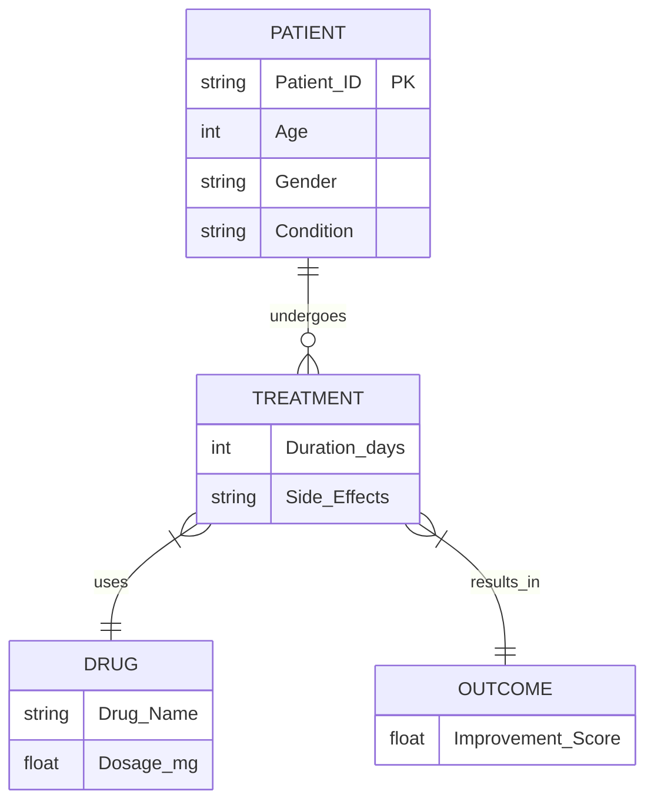

# 💽 Data Management & Schema Contracts

<div align="center">


**The foundation of the MLOps pipeline. Strictly typed, versioned, and immutable.**

[⬅️ Back to Root](../README.md)

</div>

---

## 1. Executive Overview

### Purpose

This directory manages the lifecycle of the clinical dataset. It enforces the "Data as Code" philosophy where data is:
1.  **Versioned** alongside code (via DVC).
2.  **Validated** against a strict schema (`params.yaml`).
3.  **Immutable** once ingested.

### Business Problem

*   **Drift**: Without schema enforcement, "Age" might drift from `Years` (0-100) to `Months` (0-1200) without warning.
*   **Reproducibility**: You cannot reproduce a model if you don't have the *exact* data it was trained on.
*   **Privacy**: Using real PII (Names, SSNs) in ML training is a GDPR/HIPAA violation.

### Solution

*   **DVC**: We track `.dvc` files instead of large CSVs.
*   **Pseudonymization**: The pipeline expects `Patient_ID` (e.g., `P0001`) instead of names.
*   **Contract Testing**: The `validate.py` pipeline stage strictly rejects data violating the schema.

---

## 2. Directory Structure

```
data/
├── raw/
│   ├── .gitignore              # Ignores CSVs
│   ├── real_drug_dataset.csv   # The Source of Truth (Git-ignored)
│   └── real_drug_dataset.dvc   # The Pointer (Tracked)
│
└── processed/
    ├── .gitignore              # Ignores all outputs
    ├── ingested.csv            # Copy of raw data
    ├── validated.csv           # Schema-compliant data
    ├── X_train.csv             # Training Features
    ├── X_test.csv              # Testing Features
    ├── y_train.csv             # Training Labels
    ├── y_test.csv              # Testing Labels
    └── preprocessor.joblib     # Serialized Scikit-Learn Pipeline
```

---

## 3. Data Schema & Dictionary

The schema is physically enforced by `pipelines/validate.py` based on `params.yaml`.

### Feature Columns (Inputs)

| Column Name | Type | Valid Range / Values | Description |
| :--- | :--- | :--- | :--- |
| `Patient_ID` | String | Format: `P\d+` | Unique identifier (Pseudonymized). |
| `Age` | Int | `18` - `79` | Patient age in years. |
| `Gender` | Enum | `Male`, `Female` | Biological sex. |
| `Condition` | Enum | `Diabetes`, `Hypertension`, `Depression`... | Primary diagnosis code (ICD-10 equivalent). |
| `Drug_Name` | Enum | `Metformin`, `Losartan`, `Sertraline`... | Prescribed medication. |
| `Dosage_mg` | Float | `50.0`, `100.0`, `250.0`, `500.0`, `850.0` | Daily dosage amount. |
| `Treatment_Duration_days` | Int | `5` - `59` | Length of prescribed course. |
| `Side_Effects` | Enum | `Nausea`, `Dizziness`, `Headache`... | Reported adverse events. |

### Target Column (Output)

| Column Name | Type | Valid Range | Description |
| :--- | :--- | :--- | :--- |
| `Improvement_Score` | Float | `0.0` - `10.0` | Clinical outcome metric (Higher is better). |

---

## 4. Entity Relationship Diagram (ERD)

While currently a single-table dataset, the logical model represents a **Patient Treatment Event**.



---

## 5. Usage Guide

### Ingesting New Data

1.  Place new CSV in `data/raw/`.
2.  Update DVC tracking:
    ```bash
    dvc add data/raw/real_drug_dataset.csv
    git add data/raw/real_drug_dataset.csv.dvc
    git commit -m "Update dataset: Q1 2026 Batch"
    ```
3.  Run the pipeline:
    ```bash
    dvc repro
    ```

### Troubleshooting

*   **ValidationError: Age out of range**: Check if input contains pediatric data (<18).
*   **ValidationError: Invalid Drug**: Ensure the drug is listed in `params.yaml`.
*   **"No data" error**: Ensure you have pulled the data from DVC remote (`dvc pull`).

---

## 6. Security & Compliance

*   **At Rest**: Data is stored on local disk (dev) or S3 (prod), encrypted by the storage provider.
*   **In Transit**: HTTPS for S3 transfer.
*   **Access**: Raw data access is restricted to the **Data Science Team**. The inference API never sees the training CSVs.
