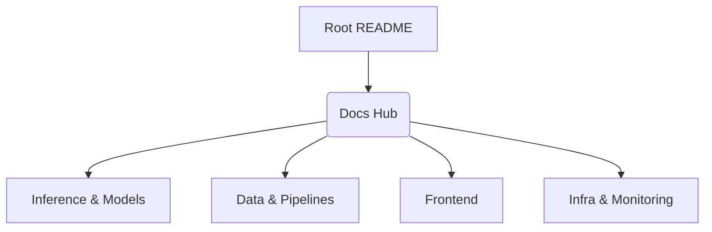

# 📚 Documentation Hub

**Central index for the MLOps System documentation.**

[⬅️ Back to Root](../README.md)

---

## 1. Executive Overview

### Purpose
The Documentation Hub acts as the centralized root node for exploring the architectural and functional documentation of the MLOps System. It indexes domain-specific README files across the repository, ensuring technical teams can rapidly locate domain-specific details.

### Business & Technical Problems Solved
Without a centralized documentation index, complex repositories devolve into tribal knowledge, increasing onboarding time and the risk of architectural violations. This hub solves the discoverability problem by mapping sub-domains securely.

### Role Within the System
It provides navigation boundaries, directing Architects towards System Design, Devs towards pipelines, and Ops towards infrastructure manifests.

---

## 2. System Context & Architecture

### Cross-System Documentation Flow
The documentation architecture maps directly to the repository’s modular design.

### Design Principles Applied
We strictly follow the **Diátaxis Framework**:
1. **Tutorials**: Onboarding & fast-starts (Root README).
2. **How-To Guides**: Action-oriented steps (Per module).
3. **Reference**: Technical lookup (Schemas & Configs).
4. **Explanation**: Context and 'Why' (Architecture sections).

---

## 3. Component-Level Design

### Core Module Navigation

| Component | Link | Responsibility |
| :--- | :--- | :--- |
| **Data** | [README](../data/README.md) | Schema definitions, DVC tracking, and data constraints. |
| **Pipelines** | [README](../pipelines/README.md) | The DAG execution (Ingest → Validate → Train → Evaluate). |
| **Training** | [README](../training/README.md) | Random Forest algorithm, hyperparameters, and logic. |
| **Models** | [README](../models/README.md) | Artifact versioning (`.joblib`) and serialization. |
| **Metrics** | [README](../metrics/README.md) | Performance reports (`scores.json`) and KPI definitions. |
| **Inference** | [README](../inference/README.md) | FastAPI service, endpoints, and validation schemas. |
| **Frontend** | [README](../frontend/README.md) | Web UI logic, DOM manipulation, and static asset serving. |
| **Infrastructure** | [README](../infra/README.md) | Docker, Kubernetes manifests, and network topology. |
| **Monitoring** | [README](../monitoring/README.md) | Prometheus & Grafana stack configuration. |
| **Validation** | [README](../validation/README.md) | CI/CD gates and release checklists. |

---

## 4. Data Design
*(Not applicable for Documentation Hub)*

---

## 5. API Design
*(Not applicable for Documentation Hub)*

---

## 6. Execution Flow
*(Not applicable for Documentation Hub)*

---

## 7. Infrastructure & Deployment
*(Not applicable for Documentation Hub)*

---

## 8. Security Architecture

All documentation is stored locally within the Git ledger. Sensitive architecture topologies or security keys must **never** be hard-coded into these documents.

---

## 9. Performance & Scalability
Documentation must remain lightweight (Standard Markdown). Heavy media assets should be optimized (e.g., compressed PNGs/WebP) to ensure fast rendering on platforms like GitHub or GitLab.

---

## 10. Reliability & Fault Tolerance
To ensure high fidelity, relative links (`../[module]/README.md`) are used exclusively over absolute canonical URLs, guaranteeing the documentation remains functional even if the repository is forked or hosted on private Git servers.

---

## 11. Observability
Documentation decay is monitored manually during code review. PRs modifying core architecture must include corresponding README updates.

---

## 12. Testing Strategy
Links within documentation should be validated through Markdown link-checker linters in CI pipelines (Recommended implementation for future updates).

---

## 13. Configuration & Environment Variables
*(Not applicable for Documentation Hub)*

---

## 14. Development Guide

### Documentation Updates
When modifying documentation across the repository:
1. Ensure the new architecture aligns with the **15-section structured standard**.
2. Preserve existing functionality explanations.
3. Update Mermaid diagrams if code flows change.
4. Keep terminology consistent (e.g., use "Inference API" rather than "Backend Server").

### Tooling Required
*   **Mermaid.js**: For generating flowcharts, sequence diagrams, and ERDs.
*   **Markdown**: Standard GitHub Flavored Markdown (GFM).

---

## 15. Future Improvements

- **Automated Link Checking**: Integrate a CI action (e.g., `lychee`) to detect dead links across the repository.
- **Documentation Site Generation**: Hook up `MkDocs` or `Docusaurus` to dynamically generate a static site from these READMEs for easier reading by non-engineers.
