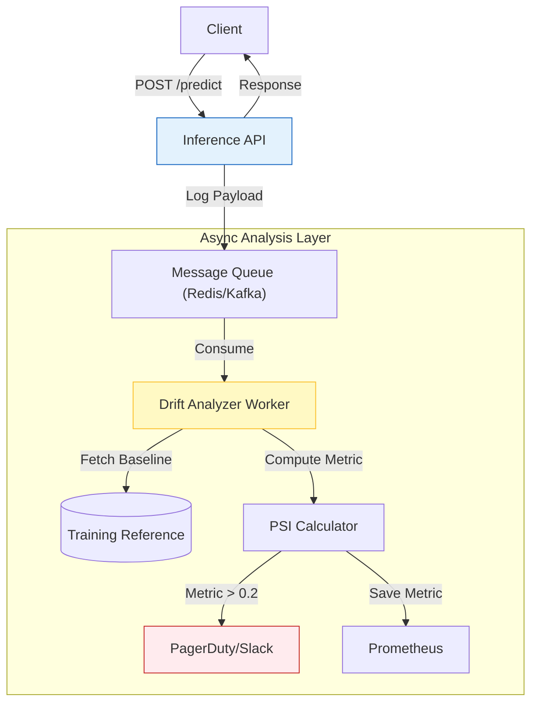

# Technical Spec: Advanced Model Monitoring

-orange?style=for-the-badge)

**Architectural proposal for Data Drift, Concept Drift, and Bias Detection.**

[⬅️ Back to Docs](./README.md)

---

## 1. Executive Summary

### Objective

Transition from **Operational Monitoring** (System Health, Latency) to **ML Observability** (Data Quality, Model Decay).

### Current State (v1.0)

- **Metrics**: Prometheus tracks `api_prediction_total` and `latency`.
- **Gap**: No visibility into *why* a model might be failing (e.g., input distribution shift).

### Proposed State (v2.0)

- **Drift Detection**: Automated alerts when input data diverges from training baseline.
- **Bias Auditing**: Real-time tracking of fairness metrics across protected groups (Gender/Age).

---

## 2. Architecture

The proposed architecture introduces a "Store & Analyze" pattern using an asynchronous sidecar.

---

## 3. Metrics Specification

### A. Data Drift (Population Stability Index - PSI)

- **Definition**: Measures the difference in distribution between the serving data ($S$) and training data ($T$) for a given feature.
- **Thresholds**:
  - $PSI < 0.1$: No significant drift.
  - $PSI \ge 0.2$: **Critical Alert**. Retraining required.

### B. Concept Drift (Prediction Shift)

- **Definition**: Change in the distribution of the predicted target variable (`Improvement_Score`).
- **Proxy**: Since ground truth comes late, we monitor the *Prediction Mean* and *Variance* over time windows (e.g., 24h rolling).