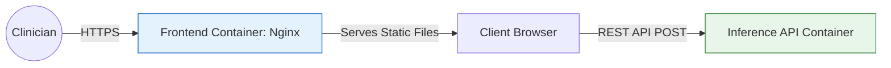
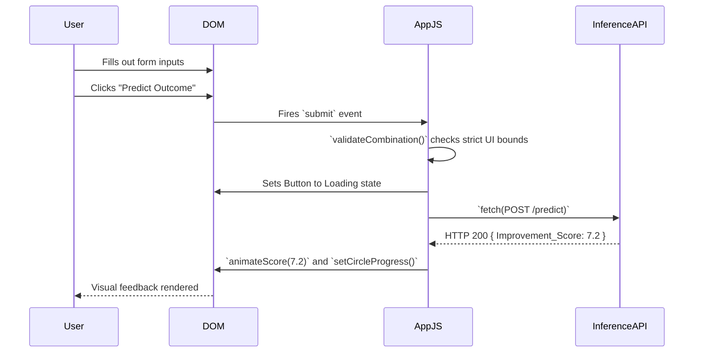

# 🖥️ Frontend Dashboard

<div align="center">


**A lightweight, dependency-free clinical interface.**

[⬅️ Back to Root](../README.md)

</div>

---

## 1. Executive Overview

### Purpose
The `frontend/` module provides a clinical dashboard GUI allowing medical researchers to input patient telemetry and receive instantaneous predicted outcome improvements. 

### Business & Technical Problems Solved
- **Business**: Clinicians require a zero-friction, highly readable interface to evaluate treatment regimens. 
- **Technical**: Heavy Single Page Application (SPA) frameworks like React or Angular introduce sprawling node_modules, npm audit vulnerabilities, and bloated bundle sizes. This module solves that by employing a zero-dependency Vanilla ES6 architecture, served as hyper-fast static assets.

### Role Within the System
This is the Presentation Layer. It is completely stateless, relying on the Inference API for all schema logic and model execution.

### High-Level Instructions
```bash
# To run locally for development without Docker:
python3 -m http.server 8080 --directory frontend/
```
In production, this module is baked into an Nginx Alpine container.

---

## 2. System Context & Architecture

### System Context Diagram



### Architectural Principles
- **Separation of Concerns**: The frontend contains zero business logic regarding medical validity; it dynamically queries the backend (`/dropdown-values`) to render state.
- **Progressive Enhancement**: Native HTML5 form validation acts as a rudimentary filter before JS-driven payload compilation.

---

## 3. Component-Level Design

### Core Files

1. **`index.html`**
   - **Responsibility**: Semantic DOM structure and accessibility markers (aria-labels).
2. **`styles.css`**
   - **Responsibility**: CSS variables (custom properties) for theming, flex/grid layouts, and SVG gauge stroke-dashoffset animations.
3. **`app.js`**
   - **Responsibility**: Event listener binding, DOM manipulation, and asynchronous HTTP fetch routines to the Inference API.

---

## 4. Data Design
*(Not applicable. See `inference/` or `data/` READMEs for schema definitions.)*

---

## 5. API Design
*(Not applicable. This component acts exclusively as an API consumer.)*

---

## 6. Execution Flow

### Form Submission Sequence



---

## 7. Infrastructure & Deployment

### Runtime Environment
In production, the static files are copied into an `nginx:alpine` image.

### Containerization Strategy
Multi-stage build is unnecessary as there is no compilation step (no Webpack/Babel). Static files are dumped directly into `/usr/share/nginx/html`.

---

## 8. Security Architecture

### Content Security Policy (CSP)
Hardened via the Nginx configuration:
- `default-src 'self'`: Thwarts basic XSS injections.
- `connect-src 'self' http://localhost:8000`: Restricts fetch requests exclusively to the defined API upstream.

### Client-Side Security Limitations
All client-side validation logic is assumed hostile. The Backend Inference API re-validates all payloads using server-side Pydantic models.

---

## 9. Performance & Scalability

- **Bundle Size**: < 20KB total (HTML + CSS + JS combined). Loads instantly even on heavily congested hospital intranets.
- **Rendering**: Hardware-accelerated CSS properties ensure the SVG gauge animation hits 60fps without triggering main-thread JS reflows.

---

## 10. Reliability & Fault Tolerance

- **API Fallbacks**: If the REST API endpoint is unreachable or returns a 5xx error, the `catch` block intercepts the payload and invokes `showError()`. This safely updates the DOM to display a user-friendly crash message instead of silently failing.

---

## 11. Observability
*(Not applicable. Standard Nginx access logs are monitored at the infrastructure level.)*

---

## 12. Testing Strategy
Currently tested via manual QA (End-to-End). 
*Recommendation: Implement Playwright or Cypress for headless E2E testing in future CI iterations.*

---

## 13. Configuration & Environment Variables

### Smart Routing
The application uses environment-aware routing instead of `.env` files for the browser context:

```javascript
const getApiUrl = () => {
    // If running in local non-docker dev
    if (window.location.hostname === 'localhost' && window.location.port === '8080') {
        return 'http://localhost:8000';
    }
    // Production Docker Nginx reverse proxy
    return '/api';
};
```

---

## 14. Development Guide

### Adding New Features
1. Append the new HTML input to `index.html`.
2. Add the element ID mapping inside the POST payload of `app.js`.
3. If it requires validation, append it to the `validateCombination` listener array.

### Debugging Approach
Use standard Chrome/Firefox DevTools. All variables are globally scoped or block-scoped without minification mapping, making breakpoint insertion trivial.

---

## 15. Future Improvements / Technical Debt

- **Build Tooling**: If the JS file grows beyond 1,000 lines, introduce Vite.js to enable modular imports (`import { x } from './utils.js'`) and minification.
- **State Management**: If multiple views (pages) are added, a lightweight router architecture (e.g., NanoRouter) should be implemented to manage the History API without refreshing.
