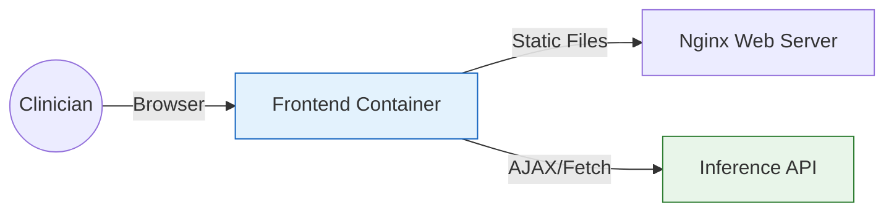

# 🖥️ Frontend Dashboard

<div align="center">


**A lightweight, dependency-free clinical interface.**
*Zero Frameworks. Maximum Performance.*

[⬅️ Back to Root](../README.md)

> [!TIP]
> **For Clinical Researchers**: You do not need to run this component individually. Please use the [Quick Start Guide](../README.md) to launch the full system via Docker.

</div>

---

## 1. Executive Overview

### Purpose

The Frontend serves as the clinician's interface to the MLOps system. It is designed to be **minimalist** and **fast**.


### Business Problem

*   **Complex Toolchains**: Integrating massive React bundles for a simple internal tool creates technical debt.
*   **Load Times**: Hospital networks can be slow; a 5MB bundle is unacceptable.
*   **Security**: Client-side dependency vulnerabilities (npm supply chain attacks).

### Solution

*   **Vanilla JS**: Uses standard ES6+ JavaScript supported by all modern browsers.
*   **Nginx Serving**: Delivered as static assets via a hardened Nginx container.
*   **Dynamic UX**: Features smooth animations (SVG gauges) and responsive error handling without external libraries.

### Architectural Positioning

This is the **Presentation Layer**. It is stateless and communicates with the *Inference API* via REST.

---

## 2. System Context & Architecture



### Interactions

1.  **Load**: Browser fetches `index.html`, `styles.css`, `app.js`.
2.  **Init**: `app.js` calls `/dropdown-values` to populate form options from the server schema.
3.  **Submit**: User submits form -> POST `/predict`.
4.  **Render**: JS updates the SVG Gauge and Score Display.

---

## 3. Component Details (`app.js`)

### Smart Routing (`getApiUrl`)

The app automatically detects its environment to handle CORS correctly or avoid it via Proxy.

```javascript
// Local Dev: Direct to API port 8000
// Docker Prod: Relative path /api (handled by Nginx reverse proxy)
const getApiUrl = () => {
    if (window.location.hostname === 'localhost' && window.location.port === '8080') {
        return 'http://localhost:8000';
    }
    return '/api';
};
```

### Key Functions

| Function | Responsibility |
| :--- | :--- |
| `fetchDropdowns()` | Fetches valid options (Gender, Drug, etc.) from API to ensure form validity. |
| `populateSelect()` | Dynamically fills `<select>` elements. |
| `animateScore()` | Cubic-bezier eased counting animation for the result number. |
| `setCircleProgress()` | SVG stroke-dashoffset calculation for the gauge visualization. |
| `updateGradientColors()` | Changes gauge color based on risk level (Red/Orange/Blue). |

---

## 4. Usage Guide

### Running Locally (No Docker)

You can run the frontend using Python's built-in HTTP server for testing.

```bash
# From project root
make run-frontend
# Serves at http://localhost:8080
```

*Note: In this mode, ensure the `inference-api` is running on port 8000.*

### Running via Docker (Production)

```bash
docker-compose -f infra/docker/docker-compose.yml up -d frontend
```

---

## 5. Security Architecture

### Content Security Policy (CSP)

The Nginx configuration (`infra/docker/nginx.conf`) enforces strict CSP:

*   `default-src 'self'`: Only load assets from same origin.
*   `connect-src 'self' http://localhost:8000`: Allow API calls to backend (or localhost for dev).
*   `script-src 'self' 'unsafe-inline'`: (Relaxed for this demo, strictly 'self' in high-security).

### Input Validation

*   **Client-Side**: HTML5 input types (`number`, `select`) provide first line of defense.
*   **Consistency**: Dropdowns are populated from the API Source of Truth, preventing "Invalid Selection" errors.

---

## 6. Development Guide

### Folder Structure

```
frontend/
├── index.html      # Structure & Layout
├── styles.css      # Styling & Variables
├── app.js          # Logic & API Glue
└── README.md       # This file
```

### Adding a New Field

1.  Add `<input>` or `<select>` in `index.html`.
2.  Add field to payload object in `app.js` event listener.
3.  Verify API accepts the new field (Update `inference/schemas.py`).
