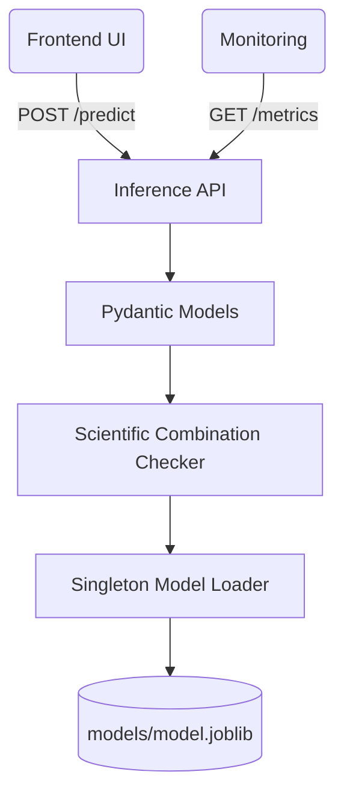
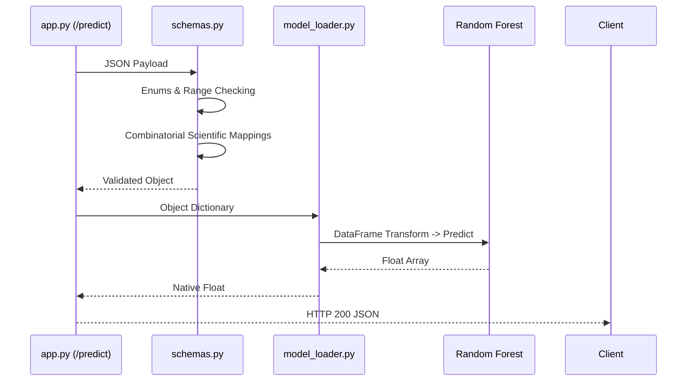

# 🚀 Inference Service

<div align="center">


**High-performance, schema-validated REST API for clinical outcome prediction.**

[⬅️ Back to Root](../README.md)

</div>

---

## 1. Executive Overview

### Purpose
The `inference/` module manages the online serving environment. It wraps the offline-trained Scikit-Learn models in a highly concurrent FastAPI shell, acting as the bridge between raw user inputs and mathematical model outputs.

### Business & Technical Problems Solved
- **Business**: Clinical models are useless if they cannot be queried synchronously by doctors.
- **Technical**: Loading multi-megabyte ML models into RAM per-request crashes servers. This service solves this through Application Lifespan singletons. Additionally, it prevents garbage data from compromising predictions via strict Pydantic schema contracts.

### Role Within the System
The core synchronous backend. It consumes outputs generated by `pipelines/` and serves them to `frontend/`.

### High-Level Instructions
```bash
# Run locally (Requires virtual environment)
pip install -r requirements-inference.txt
uvicorn inference.app:app --reload --host 0.0.0.0 --port 8000
```

---

## 2. System Context & Architecture

### System Context Diagram



### Architectural Principles
- **Fail Fast**: Missing model files crash the application boundary at boot (`lifespan`), preventing partial-state zombies.
- **Controller-Service-Repository Pattern**: `app.py` acts as the Controller. `model_loader.py` acts as the Repository. Pydantic acts as the domain Service validator.

---

## 3. Component-Level Design

### Core Modules

1. **`inference/app.py`**
   - **Responsibility**: HTTP routing, Middleware definition (CORS, CSP), Prometheus instrumentation bindings.
2. **`inference/model_loader.py`**
   - **Responsibility**: Disk I/O. Deserializes `model.joblib` and `preprocessor.joblib` into memory space strictly once.
3. **`inference/schemas.py`**
   - **Responsibility**: Type coercion, enumeration enforcement, and complex clinical validation boundaries.

---

## 4. Data Design

### DTOs / Contracts (Pydantic)
The schema acts as an inviolable shield against data poisoning.

```python
class PredictionRequest(BaseModel):
    Age: int = Field(..., ge=18, le=79)
    Condition: str
    Drug_Name: str
    Dosage_mg: float
```
*Crucially, `schemas.py` contains a `validate_scientific_combination` model validator ensuring patients cannot be processed with nonsensical drug-disease mappings based on the `valid_combinations.json` matrix.*

---

## 5. API Design

The service adheres strictly to REST mechanics.

| Endpoint | Method | Input Format | Output Format | Description |
| :--- | :--- | :--- | :--- | :--- |
| `/health` | `GET` | None | `{"status": "ok"}` | Liveness/Readiness probe. |
| `/predict` | `POST` | `PredictionRequest` JSON | `PredictionResponse` JSON | Executes model inference. |
| `/dropdown-values` | `GET` | None | `DropdownValues` JSON | Broadcasts schema enums to GUI. |
| `/metrics` | `GET` | None | Prometheus Text Format | Application state telemetry. |

---

## 6. Execution Flow

### Prediction Workflow Sequence



---

## 7. Infrastructure & Deployment

### Containerization Strategy
Uses a `python:3.11-slim` image. Implements a multi-stage `builder` to compile native C-extensions for Pandas/Scikit-Learn before stripping compilers in the final layer to reduce attack surface.

### Runtime Environment
Managed via Uvicorn (ASGI). Deployed via Docker Compose maping port 8000.

---

## 8. Security Architecture

- **Least Privilege (Execution)**: The Dockerfile creates a non-root `appuser`. If an RCE vulnerability exists in Pandas, the attacker gains no administrative root capabilities inside the container namespace.
- **Middleware Chains**:
  - `TrustedHostMiddleware`: Blocks HTTP Host header spoofing.
  - `CORSMiddleware`: Enforces Origin whitelisting to trusted frontends only.
  - `add_security_headers`: Injects CSP, blocking arbitrary inline evaluations except for Swagger UI CDN requirements.

---

## 9. Performance & Scalability

- **Concurrency**: Uvicorn event loop manages thousands of idle connections.
- **Processing**: The Sklearn `.predict()` method releases the Global Interpreter Lock (GIL) efficiently for C-level matrix multiplication, allowing rapid throughput for inference arrays.

---

## 10. Reliability & Fault Tolerance

- **Graceful Degradation**: If an unknown condition error occurs deep inside Pandas, a global `@app.exception_handler(Exception)` traps it, prevents raw python stacktraces from leaking to the client, and returns a standard `500 Internal Server Error`.

---

## 11. Observability

Instrumentation is natively bolted onto the API via `prometheus_client`.

- **`api_request_duration_seconds`**: Latency histogram. Critical for SLA monitoring.
- **`api_prediction_total`**: Usage counters.
- **`model_info`**: Constant gauge exposing the Git hash of the loaded `.joblib` model.

---

## 12. Testing Strategy

- **Unit Testing**: Pydantic schemas test boundary violations (e.g., throwing negative integers into Age).
- **Integration**: The `make validate` script runs `curl` against the `/predict` endpoint ensuring Docker routing functions.

---

## 13. Configuration & Environment Variables

| Variable | Required | Default | Description |
| :--- | :--- | :--- | :--- |
| `MODEL_PATH` | No | `models/model.joblib` | Path to Random Forest artifact. |
| `PREPROCESSOR_PATH` | No | `data/processed/preprocessor.joblib` | Path to Pipeline transformer. |
| `ALLOWED_ORIGINS` | No | `http://localhost:8080,...` | CORS Origins. |

---

## 14. Development Guide

### Adding New Features
1. Update `schemas.py` corresponding to changes in the data definition.
2. If modifying `/predict`, ensure `model_loader.py` handles any new feature mapping indices to the internal Pandas DataFrame prior to `model.predict()`.

---

## 15. Future Improvements / Technical Debt

- **Batch Inference**: Currently limited to sequential single-patient scoring via the API. Modifying the POST endpoint to accept an Array of objects would exponentially increase throughput.
- **Artifact Registry**: Moving from hard-coded local file volume mounting to dynamic downloading from MLflow or an S3 bucket at application startup.
