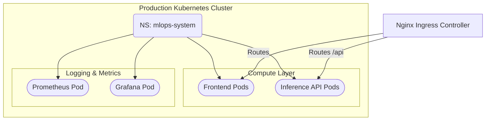

# 🏗️ Infrastructure & Deployment

<div align="center">


**Infrastructure as Code (IaC) for Local, Edge, and Production environments.**

[⬅️ Back to Root](../README.md)

</div>

---

## 1. Executive Overview

### Purpose
The `infra/` module defines the deployment architecture constraint bounds using Infrastructure as Code (IaC). It manages the containerization strategy and orchestration manifests for the entire MLOps system.

### Business & Technical Problems Solved
- **Business**: Eliminates "it works on my machine" syndromes, accelerating Time-To-Market (TTM) for clinical model updates.
- **Technical**: Provides a declarative, immutable definition of the deployment topology. Standardizes network boundaries, persistence layers, and service discovery across local Docker Compose and production Kubernetes clusters.

### Role Within the System
The foundational runtime backbone. It provisions the isolated network meshes and computes nodes required by the Frontend, Inference API, and Observability stack.

---

## 2. System Context & Architecture

### Deployment Context Diagram



### Architectural Style
- **Platform-Agnostic Microservices**: Architecture is agnostic to the underlying cloud provider (AWS/GCP/Azure) relying purely on standard Kubernetes primitives or Docker APIs.
- **Stateless Application Layer**: Frontend and API containers hold zero state, pushing state entirely to Volume Mounts (Monitoring series data).

---

## 3. Component-Level Design

### Core Directories

1. **`infra/docker/`**
   - **Responsibility**: Local/Edge deployment definitions. Contains `Dockerfile.inference`, `Dockerfile.frontend`, and the monolithic `docker-compose.yml`.
2. **`infra/k8s/`**
   - **Responsibility**: Production cluster definitions mapping equivalent compose architectures into Scalable Deployments, Services, and Namespaces.

---

## 4. Data Design
*(Not applicable to Infrastructure definitions. Volume mounts handle persistence blocks invisibly.)*

---

## 5. API Design
*(Not applicable. See `inference/README.md`)*

---

## 6. Execution Flow
*(Not applicable to static YAML manifests)*

---

## 7. Infrastructure & Deployment

### Docker Compose Topology (Local/Edge)

| Service | Container Name | Port | Description |
| :--- | :--- | :--- | :--- |
| `inference-api` | `mlops-inference-api` | `8000` | The core Python prediction engine. |
| `frontend` | `mlops-frontend` | `8080` | Nginx serving the Web UI. |
| `prometheus` | `mlops-prometheus` | `9090` | Time-series metric collector. |
| `grafana` | `mlops-grafana` | `3000` | Visualization dashboard server. |

**Command Structure**:
```bash
docker-compose -f infra/docker/docker-compose.yml up --build -d
```

### Kubernetes Topology (Production)
Deployments are separated logically to prevent blast radii overlapping.
- `00-namespace.yaml`: Hard boundary `mlops-system`.
- `01-deployment.yaml`: Replicaset controllers ensuring desired state.
- `02-service.yaml`: Internal ClusterIP DNS resolution.
- `03-monitoring.yaml`: Dedicated metric scraping pods.

---

## 8. Security Architecture

- **Rootless Containers**: Dockerfiles enforce `USER appuser` or `USER nginx` directives. Processes cannot exploit host-level kernel vulnerabilities trivially.
- **Network Isolation**: By default, Docker Compose deploys a custom bridge `mlops-network`. Containers do not expose ports automatically; only mapped host ports allow ingress.
- **Immutable Tags**: Production manifests should replace `latest` tags with explicit SHA digests to prevent upstream poisoning.

---

## 9. Performance & Scalability

- **Horizontal Pod Autoscaling (HPA)**: The `/inference` service is explicitly stateless. K8s manifests can be augmented with HPA scaled on target `CPU=70%` to spawn multiple API replicas during high HTTP load.
- **Resource Limits**: (Future recommendation) Add CPU/Memory bounds (`resources.requests` and `limits`) to preventing Noisy Neighbor out-of-memory (OOM) cluster crashes.

---

## 10. Reliability & Fault Tolerance

- **Liveness Probes**: The inference container executes an internal `HEALTHCHECK` using a localized Python HTTP request to `/health` every 30 seconds.
- **Restart Policies**: Compose dictates `restart: unless-stopped` to auto-recover from transient segfaults or kernel reboots.

---

## 11. Observability

- **Prometheus Volume Retention**: Explicitly mounted to a persistent volume `prometheus-data` to survive container cycling. Data retention defaults to 7 days to cap disk bloat.
- **Dashboards**: Grafana provisioning auto-loads structured dashboards referencing the Prometheus internal DNS target.

---

## 12. Testing Strategy
Currently tested via `docker-compose up` smoke testing and manual validation of endpoint HTTP 200s. 
*Recommendation: Implement `kube-val` or `conftest` to run static OPA (Open Policy Agent) checks on YAML files in CI.*

---

## 13. Configuration & Environment Variables

| Variable | Deployment | Default | Description |
| :--- | :--- | :--- | :--- |
| `GRAFANA_ADMIN_PASSWORD` | Docker/K8s | `changeme` | Root access for Dashboards. MUST be changed in Production. |
| `PROMETHEUS_RETENTION` | Docker | `7d` | Storage duration ceiling. |

---

## 14. Development Guide

### Applying Kubernetes Locally (Requires Minikube/Docker Desktop K8s)
```bash
kubectl apply -f infra/k8s/00-namespace.yaml
kubectl apply -f infra/k8s/
```
To observe live cluster spin-up:
```bash
kubectl get pods -n mlops-system -w
```

---

## 15. Future Improvements / Technical Debt

- **Helm Charts**: Abstracting the raw K8s YAMLs into Helm Charts (`values.yaml`) to allow dynamic environment templating (e.g., Staging vs. Prod clusters).
- **Terraform Integration**: Extend IaC to provision the underlying hardware (EKS/GKE nodes, VPCs) prior to applying workloads.
