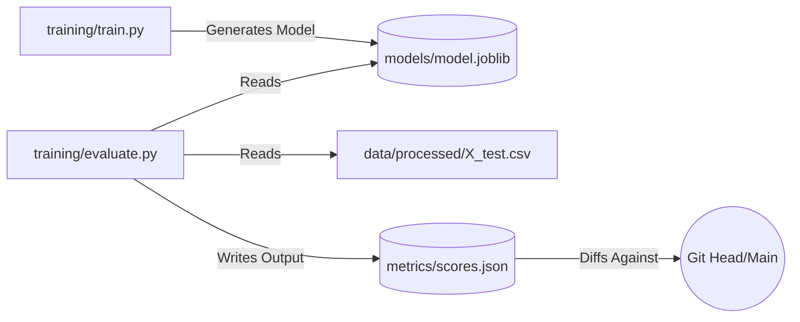

# 📈 Evaluation Metrics

<div align="center">


**Performance KPIs and telemetry thresholds for the Treatment Outcome Model.**

[⬅️ Back to Root](../README.md)

</div>

---

## 1. Executive Overview

### Purpose
The `metrics/` domain governs the offline analytical reporting of the trained Machine Learning models. It explicitly defines the quantitative thresholds the model must satisfy before progressing to the localized model registry.

### Business & Technical Problems Solved
- **Business**: Clinical stakeholders require interpretable performance benchmarks (e.g., "The model is off by +/- 2 improvement points on average") to ascertain deployment risk.
- **Technical**: Models degrade mathematically even if the code remains static. Generating codified `scores.json` files allows CI/CD to implement automated "Quality Gates" comparing current pulls against `main` Git branches.

### Role Within the System
It operates strictly in the Data Pipeline phase. It is generated by `training/evaluate.py` and consumed by DVC tracking layers.

---

## 2. System Context & Architecture

### Metrics Provenance



### Architectural Principles
- **JSON Serialization**: Using standard JSON over proprietary objects ensures the metrics can be crawled by GitHub Actions, DVC natively, or third-party webhooks.

---

## 3. Component-Level Design

### Core Files
1. **`metrics/scores.json`**
   - **Responsibility**: Holds the deterministic snapshot of the latest DAG run's efficacy.

*(Note: The logic calculating these metrics resides in `training/evaluate.py`)*

---

## 4. Data Design

### Metrics Schema (`scores.json`)

The data structure is strictly flattened.

```json
{
  "rmse": 6.12,
  "mae": 4.5,
  "r2": 0.05
}
```

### Analytical Definitions

| Metric | Full Name | Goal | Description |
| :--- | :--- | :--- | :--- |
| **RMSE** | Root Mean Squared Error | **Minimize** | Standard deviation of the residuals. Hyper-penalizes massive outliers—crucial in healthcare where a single wildly wrong prediction is worse than several small errors. |
| **MAE** | Mean Absolute Error | **Minimize** | Average absolute difference (linear scaling) between predicted and actual improvement score. |
| **R²** | Coefficient of Determination | **Maximize** (-> 1.0) | Proportion of variance explained by the model over a baseline mean. |

---

## 5. Execution Flow

### Evaluation Phase (DAG Step 4)

1. Scikit-Learn `.predict()` invoked on held-out 20% validation split.
2. Predictions arrays mapped against truth arrays.
3. Errors calculated via `sklearn.metrics`.
4. File overwritten in-place at `metrics/scores.json`.
5. DVC recognizes file hash change.

---

## 6. Security Architecture
Metrics expose generalized aggregate efficacy. They contain absolutely no PII, rows of data, or reversible weights that could succumb to a model inversion attack. Safely committable to raw Git history if desired for visualization.

---

## 7. Performance & Scalability
Running the evaluation pipeline on datasets > 10GB will bottleneck RAM during the metrics matrix calculation in Scikit-Learn. Future scalability requires pushing metric generation into a Spark cluster or using Dask-ML.

---

## 8. Reliability & Fault Tolerance
If the output target metrics contain `NaN` or `Infinity` (often due to exploding gradients or broken scaled features upstream), the JSON serialization process will succeed but subsequent CI threshold checks will cleanly fail the build.

---

## 9. Observability

Integration with Data Version Control allows powerful CLI-level observability across time boundaries:

```bash
# Compare current staged model against the production branch
dvc metrics diff --show-json
```

---

## 10. Testing Strategy

- **Quality Gates (CI)**: (Future) Implement a `pytest` hook asserting `metrics["rmse"] < 5.0` inside the `make validate` pipeline.

---

## 11. Development Guide

### Synthetic Data Disclaimer
> [!NOTE]
> **Baseline Expectation**: The current raw dataset is intentionally stripped of overwhelming correlations to mimic challenging edge-case clinical environments. Do not expect (or force) R² values > 0.8 without fundamentally altering the feature generation in `pipelines/ingest.py`.

---

## 12. Future Improvements / Technical Debt

- **Advanced Telemetry**: Expand tracked metrics to include `median_absolute_error` and `explained_variance_score` to build a deeper statistical profile of model drift.
- **Fairness Metrics**: Implement demographic slice metrics (e.g., tracking MAE strictly on the `Gender: Female` cohort vs `Male`) to programmatically ban models exhibiting bias.
