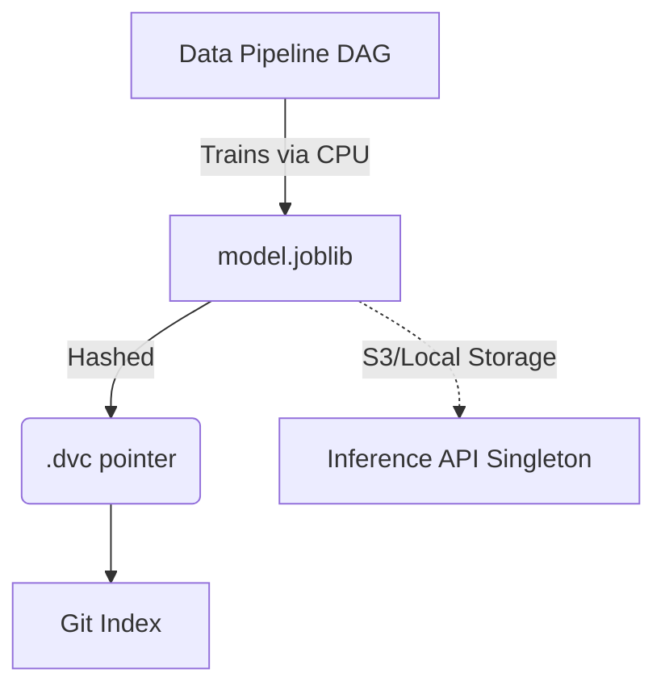

# 📦 Model Artifacts

<div align="center">


**Serialized, offline-trained machine learning architectures and transformers.**

[⬅️ Back to Root](../README.md)

</div>

---

## 1. Executive Overview

### Purpose
The `models/` module stores the compiled, binary representations of the trained algorithm. It represents the mathematical "brain" consumed by the Inference API to execute predictions.

### Business & Technical Problems Solved
- **Business**: Guarantees that the exact decision tree logic approved during offline R&D is the identical mathematical entity functioning in the live clinical environment.
- **Technical**: Avoids committing multi-gigabyte binary blobs to the Git history, which severely bloats repository cloning speeds. Resolves "works on my machine" discrepancy through strict Scikit-Learn version pinning globally.

### Role Within the System
It operates as the hand-off boundary (Registry) between the Offline Training Pipeline and the Online Inference Service.

---

## 2. System Context & Architecture

### Artifact Provenance



### Architectural Principles
- **Decoupled Pointers**: The model is completely abstracted from Source Control. Git tracks `.dvc` files containing SHA-256 hashes instead of weights.
- **Pipeline Segregation**: Preprocessing logic (Scalers, Encoders) is saved independently (`preprocessor.joblib`) from mathematical estimators.

---

## 3. Component-Level Design

### Core Abstractions

1. **`models/model.joblib`** (Git-Ignored)
   - **Responsibility**: Serialized `RandomForestRegressor` Scikit-Learn estimator.
2. **`models/model.joblib.dvc`** (Git-Ignored)
   - **Responsibility**: The pointer file. Links the current git branch mathematically to the correct S3/Drive bucket blob storing the model.

---

## 4. Data Design

### Internal Mathematical Graph (Random Forest)
The artifact contains an ensemble of decision trees.

- **Parameters Tracked**:
  - `n_estimators`: `200` (Number of trees)
  - `max_depth`: `15` (Complexity ceiling restraining memorization/overfitting)
  - `min_samples_split`: `5`
  - `min_samples_leaf`: `2`

All hyperparameters dictating this architecture are injected via the global `params.yaml` prior to compilation.

---

## 5. Execution Flow
*(See [training/README.md](../training/README.md) for generation flow; [inference/README.md](../inference/README.md) for consumption flow)*

---

## 6. Infrastructure & Deployment

### Compatibility Matrix Constraint
> [!WARNING]
> Scikit-Learn `.joblib` serialization uses Python's `pickle` engine under the hood. It is highly sensitive to library drift. Training on version 1.4 and inferencing on 1.2 will cause uncatchable C-level segfaults.

| Dependency | Statically Pinned Version | Scope |
| :--- | :--- | :--- |
| **Python** | `3.10+` | Interpreter Context |
| **Scikit-Learn** | `1.4.1` | Math Definitions |
| **Joblib** | `1.3.2` | Serialization Engine |

---

## 7. Security Architecture

- **Unpickling Attack Vectors**: Deserializing `.joblib` files can execute arbitrary RCE payload code embedded maliciously. 
- **Mitigation**: The system is Architected with Zero-Trust. The API **never** loads models dynamically from user inputs. Models are strictly generated by internal trusted CI runners and checksummed by DVC.

---

## 8. Performance & Scalability

- **Disk Footprint**: Random Forests expand linearly based on `n_estimators` and exponentially by `max_depth`. The current configuration generates an artifact roughly `< 5MB`, optimizing Docker image injection.
- **Memory Mapping (`mmap`)**: If model size exceeds 1GB in the future, the Inference `joblib.load()` syntax must be updated to `mmap_mode='r'` to chunk memory allocation.

---

## 9. Reliability & Fault Tolerance
- **Corrupted Blobs**: If a partial download of `model.joblib` occurs via DVC, the hash checksum validation fails immediately, halting deployments before corrupted logic enters production.

---

## 10. Observability
*(Not directly applicable to static binaries. Model versions are exposed globally via the Prometheus `model_info` gauge deployed in the Inference API.)*

---

## 11. Testing Strategy
- **Deserialization Test**: `make validate` ensures the model can successfully instantiate locally.

---

## 12. Development Guide

### Loading Artifacts Locally (Jupyter Context)

```python
import joblib

# Isolate Model Mathematical Logic
model = joblib.load("models/model.joblib")

# Isolate Mapping Transforms 
preprocessor = joblib.load("data/processed/preprocessor.joblib")
```

---

## 13. Future Improvements

- **Format Migration**: Deprecate `.joblib` in favor of **ONNX (Open Neural Network Exchange)**. ONNX fundamentally disconnects the model from Python, enabling runtime execution directly in C++ or Rust for 10x throughput increases and enhanced security profiles.
- **Model Registry Integration**: Shift from tracking via flat `.dvc` files to an active MLflow Model Registry to support Blue/Green traffic shadowing and Champion/Challenger deployment comparisons.