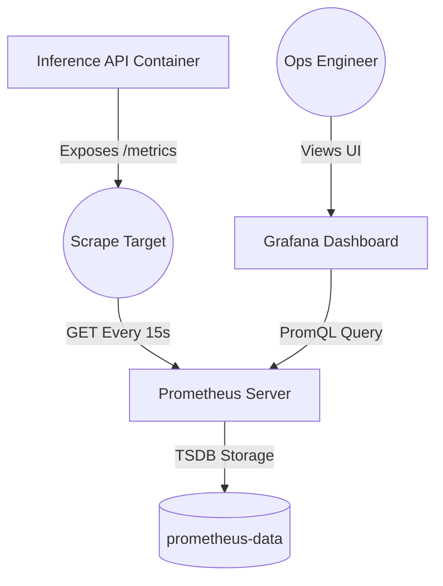

# 📊 Monitoring & Observability

**Glass-box monitoring telemetry for API Health and System Performance.**

[⬅️ Back to Root](../README.md)

---

## 1. Executive Overview

### Purpose
The `monitoring/` module defines the Site Reliability Engineering (SRE) stack. It provisions Prometheus for scraping time-series telemetry from the Inference API and Grafana for visual dashboards and alerting.

### Business & Technical Problems Solved
- **Business**: Clinical platforms cannot afford silent failures. Latency spikes or drops in inference throughput indicate systemic issues requiring immediate triage.
- **Technical**: Centralizes logs and operational metrics outside the volatile API containers. Enables historical querying of API behavior to track Service Level Objectives (SLOs).

### Role Within the System
The Observability sidecar layer. It passively monitors the Inference API without interfering with the mathematical processing loop.

---

## 2. System Context & Architecture

### Telemetry Topology

### Architectural Principles
- **Pull-Based Telemetry**: Prometheus actively fetches (`pulls`) metrics from services, rather than services pushing metrics. If the API dies, Prometheus inherently knows because the scrape fails (yielding an `up == 0` metric).
- **Stateless Configuration**: Grafana explicitly relies on "Provisioning as Code." Dashboards are injected dynamically on boot. No manual clicking through UI menus is required to set up the environment.

---

## 3. Component-Level Design

### Core Directories & Files

1. **`prometheus.yml`**
   - **Responsibility**: Tells Prometheus which endpoints to poll and how frequently.
2. **`grafana/provisioning/datasources/datasources.yml`**
   - **Responsibility**: Silently connects Grafana to the Prometheus backend on boot.
3. **`grafana/provisioning/dashboards/`**
   - **Responsibility**: Contains the declarative JSON definition for the "Clinical Prediction API Dashboard".

---

## 4. API Design

Prometheus acts as an internal HTTP client polling the Inference Service.
- **Scrape Path**: `http://inference-api:8000/metrics`
- **Format**: Prometheus Text-Based Exporter Format.

---

## 5. Execution Flow

### Dashboard Rendering Sequence
1. API records a counter increment when a user hits `/predict`.
2. 15 seconds later, Prometheus fetches the updated counter mapping via `/metrics`.
3. Prometheus appends the counter to its internal Time-Series Database (TSDB).
4. SRE clicks refresh on Grafana.
5. Grafana executes a PromQL `rate()` query against the TSDB and maps the visual graph.

---

## 6. Infrastructure & Deployment

### Deployment Containers
Mounted automatically via `infra/docker/docker-compose.yml`.
- **Prometheus UI**: Port `9090`
- **Grafana UI**: Port `3000`

### Volume Mounts
- `prometheus-data`: Survives container recreation to preserve historical metrics.
- `grafana-data`: Preserves session tokens or modified user accounts.

---

## 7. Security Architecture

- **Internal Scrapes Only**: The `9090` port should theoretically be fenced behind strict firewall rules (VPC bounds) in production so exterior actors cannot scrape operational metrics or footprint the technology stack.
- **Grafana Auth**: Shipped with basic auth enabled by default, initialized via `GF_SECURITY_ADMIN_PASSWORD`.

---

## 8. Performance & Scalability

- **Scrape Frequency**: 15 seconds provides high-fidelity monitoring without overwhelming the API thread pool context switching.
- **Data Retention**: Capped at 7 days. Metric logs bloat exponentially; retention is hard-capped explicitly to avoid disk exhaustion out-of-memory errors on smaller EC2 instances.

---

## 9. Reliability & Fault Tolerance
- **Decoupled Architecture**: If Grafana or Prometheus completely crash, the `inference-api` is entirely unaffected and will continue serving clinical predictions securely.

---

## 10. Observability

### Dashboard Capabilities (`Clinical Prediction API Dashboard`)
- **System Health**: Binary UP/DOWN node status.
- **Latency Tracking**: P50, P95, and P99 boundaries (critical for spotting performance trailing edges).
- **Throughput**: Requests Per Second (`rate(api_prediction_total[5m])`).
- **Error Rates**: Ratio of 4xx/5xx responses to 200 OKs.

---

## 11. Testing Strategy
Currently tested via manual integration verifications ("Does Grafana load?").
*Recommendation: Use `promtool` to formally lint `prometheus.yml` correctness within CI hooks.*

---

## 12. Configuration & Environment Variables

| Variable | Target | Default | Description |
| :--- | :--- | :--- | :--- |
| `GF_SECURITY_ADMIN_PASSWORD` | Grafana | `changeme` | Console login credentials. |
| `scrap_interval` | Prometheus | `15s` | Polling frequency. |

---

## 13. Development Guide

### Troubleshooting "No Data" Scenarios
1. Open Prometheus target page (`http://localhost:9090/targets`). Verify `inference-api` is green (`UP`).
2. If down, the API container is either not running or Docker DNS is failing to resolve `inference-api`.
3. To test dashboards locally, simulate load using `curl` or Apache Bench (`ab`) against the `/predict` endpoint.

---

## 14. Future Improvements

- **Alertmanager Integration**: Wire Prometheus to PagerDuty or Slack via `alertmanager` to actively notify the ops team if error rates eclipse 1% or latency eclipses 500ms.
- **Data Drift Dashboards**: Currently, only operational compute metrics are captured. Expand Grafana to track Model Drift (Changes in the distribution of predicted improvement scores over time).
