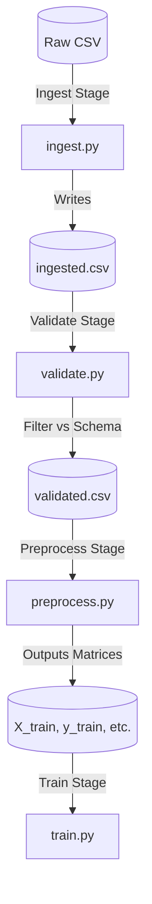

# ⚙️ Data Pipelines (DVC)

<div align="center">


**The production pipeline for reproducible model training and data transformation.**

[⬅️ Back to Root](../README.md)

</div>

---

## 1. Executive Overview

### Purpose
The `pipelines/` module orchestrates the offline Directed Acyclic Graph (DAG) for data ingestion, cleaning, validation, preprocessing, and model training. 

### Business & Technical Problems Solved
- **Business**: Clinical research relies entirely on provable reproduciblity. "It worked yesterday" is an invalid excuse in audited medical environments.
- **Technical**: Avoids bloated shell scripts that blindly execute the entire pipeline when only a single downstream variable changed. DVC natively caches unchanged intermediate steps, slashing iteration time. 

### Role Within the System
The "Data Factory". It connects raw datasets from the `data/` module, passes them through validations, and hands the preprocessed artifacts over to the `training/` module.

### High-Level Instructions
```bash
# Execute the entire DAG. Will skip cached phases automatically.
dvc repro
```

---

## 2. System Context & Architecture

### DAG Flow Architecture



### Architectural Principles
- **Idempotency**: Given the exact same raw data hash and `params.yaml` configuration, the pipeline is mathematically guaranteed to emit the identical serialized artifact.
- **Modular Nodes**: Each Python script inside the pipeline is strictly bound to one responsibility (e.g., `preprocess.py` focuses entirely on Scikit-Learn scaling operations without caring about ingestion logic).

---

## 3. Component-Level Design

### Core Modules

1. **`dvc.yaml`**
   - **Responsibility**: The master blueprint. Explicitly defines the graph edges, binding scripts to their input dependencies (`deps`) and expected outputs (`outs`).
2. **`pipelines/ingest.py`**
   - **Responsibility**: Extracts tracking schemas. Generates `ingested.csv` from raw external references.
3. **`pipelines/validate.py`**
   - **Responsibility**: Schema enforcement. Executes column, type, and range checks against the Pandas DataFrame using valid values defined in `params.yaml`.
4. **`pipelines/preprocess.py`**
   - **Responsibility**: Normalization and Encodings. Executes train_test_split. Compiles and dumps the Scikit-Learn `ColumnTransformer` Pipeline artifact (`preprocessor.joblib`).
5. **`pipelines/extract_combinations.py`**
   - **Responsibility**: Scans clinical data to construct the `valid_combinations.json` constraint matrix used dynamically by the Inference API zero-trust framework.

---

## 4. Data Design
*(Refer to [data/README.md](../data/README.md) for explicit CSV schema constraints)*

---

## 5. Execution Flow

### State Transitions (Caching Logic)
DVC tracks state via MD5 hashing. 
1. If `real_drug_dataset.csv` changes, DVC invalidates the cache and reruns all steps.
2. If `params.yaml` -> `max_depth` changes, DVC recognizes the Data steps are untouched and utilizes the cache, bypassing ingestion/preprocessing and immediately triggering the Training script.

---

## 6. Infrastructure & Deployment
Pipelines are inherently offline operational scripts. They are executed within locally on developer machines via virtual environments. They are never pushed into the Docker orchestration runtime.

---

## 7. Security Architecture
The extraction boundary operates entirely locally. Validated raw data is blocked from transit via `.gitignore`. 

---

## 8. Performance & Scalability
- **Memory Profiling**: Current pipeline steps construct Pandas DataFrames entirely in RAM. Scalability limits correlate directly to host machine memory bounds.
- **Disk I/O**: The pipeline makes heavy use of localized POSIX disk storage. Performance benefits drastically from NVMe disk architectures over spinning HDDs.

---

## 9. Reliability & Fault Tolerance
- **Strict Failure Handling**: Any Python exception generated (e.g., Validation Failure inside `validate.py`) cascades up as a non-zero exit code. DVC immediately aborts the pipeline, preventing broken artifacts from proceeding down the DAG.

---

## 10. Observability
- **DAG Visualization**: Developers can observe the structural dependency graph statically.
```bash
dvc dag
```

---

## 11. Testing Strategy
- **Contract Verification Check**: Pipeline code must reliably execute standard unit tests targeting normalization edges prior to deployment.
- **Integration Run**: `make validate` ensures the full pipeline completes end-to-end flawlessly on sample datasets without crashing.

---

## 12. Configuration & Environment Variables
Configured comprehensively via `params.yaml`.

| Key Tree | Example Value | Description |
| :--- | :--- | :--- |
| `schema.numeric_features` | `['Age', 'Dosage_mg']` | Feeds the StanderScaler preprocessor logic. |
| `schema.categorical_features` | `['Condition']` | Feeds the OneHotEncoder logic. |

---

## 13. Development Guide

### Running Specific Stages
If modifying only the evaluation script, you do not need to wait for retraining:
```bash
# Will only execute evaluating layers, using cached models
dvc repro evaluate
```

---

## 14. Future Improvements / Technical Debt

- **Distributed Orchestration**: While DVC is excellent for repository-level pipelines, enterprise scaling may necessitate migrating these nodes into Airflow or Prefect to handle distributed cross-cluster DAG execution logic for terabyte-scale payloads.
- **Feature Store Pushing**: Implement an explicit phase after preprocessing to push embedded feature matrices into a centralized Redis/Feast store for faster Online Inference retrieval.
