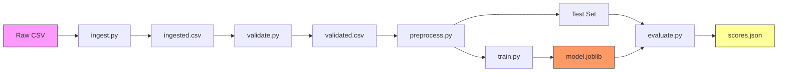

# ⚙️ Data Pipelines (DVC)

<div align="center">


**The production pipeline for reproducible model training.**

[⬅️ Back to Root](../README.md)

> [!TIP]
> **For Managers**: You can reproduce the entire pipeline by running `make run-pipeline` from the root directory.

</div>

---

## 1. The Pipeline DAG

The Directed Acyclic Graph (DAG) is defined in `dvc.yaml`. It ensures that every step is cached and only re-run if its dependencies (code or data) change.



---

## 2. Stages & Artifacts

| Stage | Script | Input | Output | Description |
| :--- | :--- | :--- | :--- | :--- |
| **Ingest** | `pipelines/ingest.py` | `raw/real_drug_dataset.csv` | `processed/ingested.csv` | Immutable copy of raw data. |
| **Validate** | `pipelines/validate.py` | `processed/ingested.csv` | `processed/validated.csv` | Schema enforcement. Fails pipeline on invalid data. |
| **Preprocess** | `pipelines/preprocess.py` | `processed/validated.csv` | `X_train`, `y_test`, etc. | Splitting (80/20) and Feature Engineering. |
| **Train** | `training/train.py` | `X_train.csv`, `y_train.csv` | `models/model.joblib` | Training RandomForestRegressor. |
| **Evaluate** | `training/evaluate.py` | `model.joblib`, `X_test.csv` | `metrics/scores.json` | Calculating RMSE/R². |

---

## 3. Configuration (`params.yaml`)

The pipeline execution is controlled by `params.yaml`. Key tuning parameters:

```yaml
model:
  n_estimators: 200     # Number of trees
  max_depth: 15         # Tree depth
  min_samples_split: 5  # Node split threshold
```

---

## 4. Usage

### Reproduce the Pipeline

To run the entire end-to-end flow:

```bash
dvc repro
```

### Run a Specific Stage

To run only the validation step (and its dependencies):

```bash
dvc repro validate
```

### Visualize the DAG

```bash
dvc dag
```
