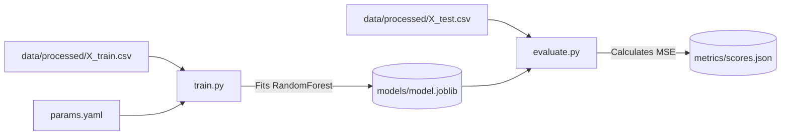

# 🧠 Model Training

<div align="center">


**Training logic, hyperparameter tuning, and experiment evaluation.**

[⬅️ Back to Root](../README.md)

</div>

---

## 1. Executive Overview

### Purpose
The `training/` module houses mathematical convergence logic. It applies Scikit-Learn estimators against the sanitized feature matrices generated by the Data Pipelines to learn generalized patterns for predicting clinical outcomes.

### Business & Technical Problems Solved
- **Business**: Creates the heuristic engine enabling clinicians to forecast improvement scores before administering treatment.
- **Technical**: Separates chaotic Data Cleansing scripts from pure Mathematical compilation logic. Enforces deterministic training runs driven strictly by YAML configuration arrays.

### Role Within the System
Operates exclusively as the penultimate step inside the Offline DAG, preceding the Evaluation phase.

---

## 2. System Context & Architecture

### Training Context



### Design Principles Applied
- **Algorithm Transparency**: In medical contexts, Neural Networks are often heavily scrutinized "Black Boxes." A Random Forest architecture was chosen deliberately because Tree-based models allow intuitive extraction of localized Feature Importances natively.

---

## 3. Component-Level Design

### Core Modules

1. **`train.py`**
   - **Responsibility**: Instantiates the Scikit-Learn object, reads the matrices, executes `.fit()`, and dumps the resultant serialized estimator to disk.
2. **`evaluate.py`**
   - **Responsibility**: Evaluates the fitted model against unseen test benchmarks. Calculates standard regression KPIs (RMSE, MAE, R-Squared).

---

## 4. Data Design
*(See metrics/README.md for `scores.json` definitions. Inputs are universally expected as Pandas DataFrames containing Float64 structures).*

---

## 5. API Design
*(Not applicable)*

---

## 6. Execution Flow

### Algorithmic Sequence
1. Load X/Y boundaries.
2. Construct parameter kwargs natively via `yaml.safe_load`.
3. Spawns Scikit-Learn compilation threading (C/C++ base execution) via BLAS/LAPACK bindings.
4. Completes matrix multiplication.
5. Captures and stdout prints the `feature_importances_` indices for manual observability.
6. Writes `.joblib` entity.

---

## 7. Infrastructure & Deployment
Executed functionally within stateless Python Virtual Environments or transient CI runners. Exists completely outside the containerized operational boundaries.

---

## 8. Security Architecture
The training logic processes entirely localized pseudonymized arrays. No network-level API requests are fired during the compile step, eliminating external exfiltration or poisoning attack vectors outside of the explicit Code dependencies.

---

## 9. Performance & Scalability

- **Concurrency Model**: The Random Forest regressor natively implements parallel tree construction via the `n_jobs` parameter. Setting this to `-1` will utilize all available CPU cores, massively accelerating execution time across massive datasets on heavily provisioned compute servers.
- **Memory Consumption**: Scikit-Learn requires the entire dataset array to reside simultaneously in RAM. If row count breaches node bounds, migration to incremental fitting (e.g., `SGDRegressor`) or PySpark is mandated.

---

## 10. Reliability & Fault Tolerance
Training executes linearly. If matrices contain non-numerical values or `NaN` outputs escaping validation stages, the C-level Scikit-Learn bindings will natively trap the error and invoke a fatal kernel exception cleanly.

---

## 11. Observability
Logs natively generated print statements during evaluation to stdout, tracking Mean Squared Errors cleanly in the CLI terminal output buffer.

---

## 12. Testing Strategy
Unit tests target evaluating that `evaluate.py` generates accurate floating-point math consistently when given mocked constant predictions over a baseline mock series array.

---

## 13. Configuration & Environment Variables

| Parameter | Current YAML Value | Optimization Goal |
| :--- | :--- | :--- |
| `n_estimators` | `200` | Smooths prediction variance across trees. |
| `max_depth` | `15` | Critical mechanism restricting algorithm overfitting logic. |
| `min_samples_split` | `5` | Regularization limiting trivial leaf construction. |

---

## 14. Development Guide

### Interactive Local Debugging
To bypass DVC orchestration entirely to rapidly debug Scikit-Learn parameter changes visually:
```bash
# Export concurrency parallelization requests locally
export N_JOBS=4
python training/train.py
python training/evaluate.py
```

---

## 15. Future Improvements / Technical Debt

- **Experiment Tracking Integration**: Migrate towards native MLflow embedding natively inside `train.py`. Capturing hyperparameters manually inside git is robust logic, but a visualization dashboard tracking hundreds of historical GridSearch runs provides vastly better data science analytics.
- **Hyperparameter Optimization (HPO)**: Integrate an `optuna` layer to programmatically grid-search the optimal `max_depth` ranges against Cross-Validation boundaries in place of static YAML dictation.
