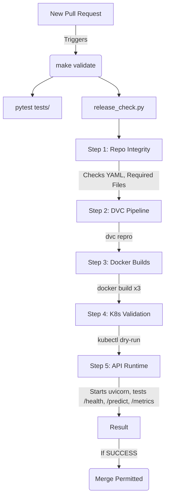

# 🚦 Release Validation & CI/CD

<div align="center">


**Automated quality gates restricting infrastructure deployments ensuring system health integrity.**

[⬅️ Back to Root](../README.md)

</div>

---

## 1. Executive Overview

### Purpose
The `validation/` module serves as the final arbiter preventing regressions from entering production. It executes rigorous boundary checks across the application footprint bridging Data, Code, and Operations.

### Business & Technical Problems Solved
- **Business**: Protects users from operational downtime.
- **Technical**: Integrates disparate ecosystem failures—such as a DVC hash mismatch, a malformed Docker manifest, or a JSON Pydantic crash—into a singular unifying Failure Exit Code natively parsed by GitHub Actions / CI runners.

### Role Within the System
The CI/CD Gatekeeper context. Executed fundamentally as a precondition before branch merging or container tagging.

---

## 2. System Context & Architecture

### Continuous Integration Context



### Architectural Principles
- **End-To-End Ephemeral Checking**: Tests execute actively against temporary runtime sandboxes, assuring zero "mock bias" across integration checkpoints.
- **Fail Fast Execution**: Halts execution cleanly at the earliest detection event, ensuring developer loop feedback returns instantly.

---

## 3. Component-Level Design

### Core Modules

1. **`validation/release_check.py`**
   - **Responsibility**: Comprehensive 5-step release validation. Checks repository integrity, runs the DVC pipeline, builds Docker images, validates K8s manifests, and performs runtime API testing with automatic startup/teardown.

---

## 4. Execution Flow

### Comprehensive Sequence ( `make validate` )
1. **Step 1 — Repository Integrity**: Verifies all mandatory files exist (`README.md`, `dvc.yaml`, `params.yaml`, Dockerfiles, K8s manifests). Validates YAML syntax.
2. **Step 2 — DVC Pipeline**: Executes `dvc repro` end-to-end. Verifies `model.joblib`, `scores.json`, and `preprocessor.joblib` are produced.
3. **Step 3 — Docker Builds**: Builds all 3 Docker images (training, inference, frontend). Verifies Docker daemon is reachable.
4. **Step 4 — K8s Validation**: Runs `kubectl apply --dry-run=client` against all K8s manifests. Verifies NodePort configuration.
5. **Step 5 — API Runtime**: Starts the API via `uvicorn`, polls `/health` with retry loop (15 attempts), sends a valid prediction to `/predict`, and verifies `/metrics` exposes Prometheus counters. Cleans up the process on exit.

---

## 5. Infrastructure & Deployment
Runs locally natively via standard bash binaries (`python`, `docker`, `curl`).

---

## 6. Security Architecture
The release validation inherently catches massive misconfigurations. If Docker files contain faulty `EXPOSE` logic or missing Security Header arrays natively expected during startup sequences, the health checks will trap an operational failure.

---

## 7. Performance & Scalability
Validation cycles efficiently run under 60-seconds locally leveraging pervasive layer caching via the Docker daemon engine avoiding total scratch builds.

---

## 8. Reliability & Fault Tolerance
Linear sleep loops protect against race conditions where the Kestrel/Uvicorn HTTP bindings map slowly compared to instantaneous curl logic firing mechanisms.

---

## 9. Observability
Detailed console logs generated.
```text
[INFO] Starting release validation...
[INFO] Step 1: Checking code integrity... OK
[INFO] Step 2: DVC Pipeline check... OK
[INFO] Step 3: Docker build check... OK
[SUCCESS] Release validation passed!
```

---

## 10. Testing Strategy
The validation module **is** the core integration testing boundary executing End-To-End routines. 

---

## 11. Development Guide

### Initiating Validations locally
To execute standard checks:
```bash
make validate
```
If errors trap, read the standard `stderr` to identify if the boundary breach occurred in the Code Syntax, the Offline Network, or the Runtime Execution mapping.

---

## 12. Future Improvements

- **Comprehensive Security Scanning**: Integrate tools like `trivy` natively inside `release_check` boundaries to scan built Docker geometries recursively checking against upstream CVE registry lists.
- **Expanded Application Testing**: Shift towards PyTest frameworking standardizing reporting outputs to standardized `.xml` arrays consumable by Jenkins tracking GUIs automatically.
